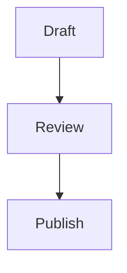
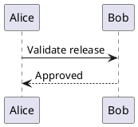

# Diagram Fixtures

Mermaid diagrams should round-trip as fenced Markdown without interpreting the source
inside the codec.



PlantUML diagrams are host-rendered in UI packages, but the codec must preserve the
source bytes exactly.



Indented fence-like text inside prose should stay ordinary Markdown.

    ```mermaid
    graph LR
    ```
